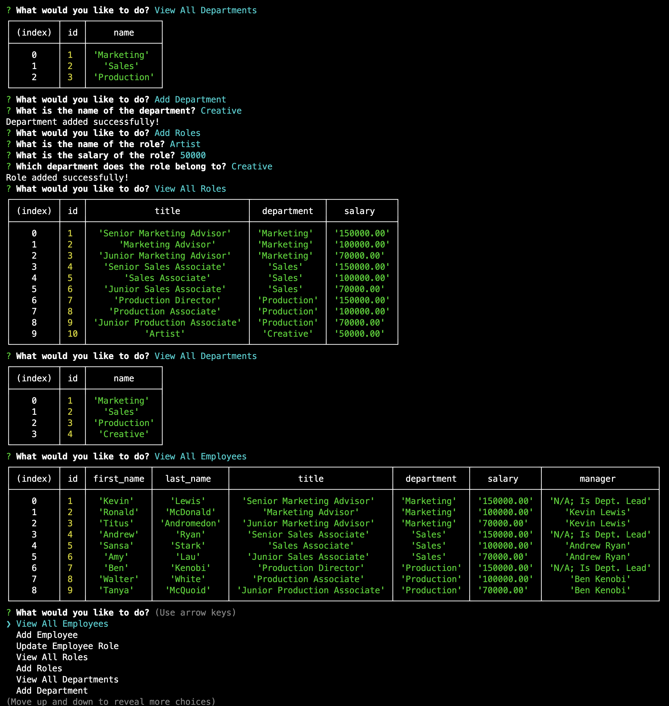

# ***The Employee Tracker***

 

## Overview
This simple Application allows businesses to review and edit a database of their employees through the command-line interface (CLI).

 

## Application Instructions
• To run the app, you must first log-on with your MySQL credentials from your CLI.
• Then, run "SOURCE schema.sql" and "SOURCE seeds.sql".

• Once the database is ready, open another CLI and enter "node index.js" from your root folder.

• Select the option you'd like to view or update, with the arrow keys on your keyboard and hit enter to continue.
• Follow prompts to carry out your chosen task.

 

## Screen-Cap of the Application

 

## Application Demo Video
https://github.com/KPL33/Employee_Tracker/blob/main/Assets/Kevin_Lewis_Employee_Tracker_demo.webm

 

## Contributors To This Application
Kevin Lewis

 

# ***Thank you for using this App!***

 

## Questions? Contact the Developer on GitHub... 
KPL33
## ...or via Email
kevinsname2003@yahoo.com